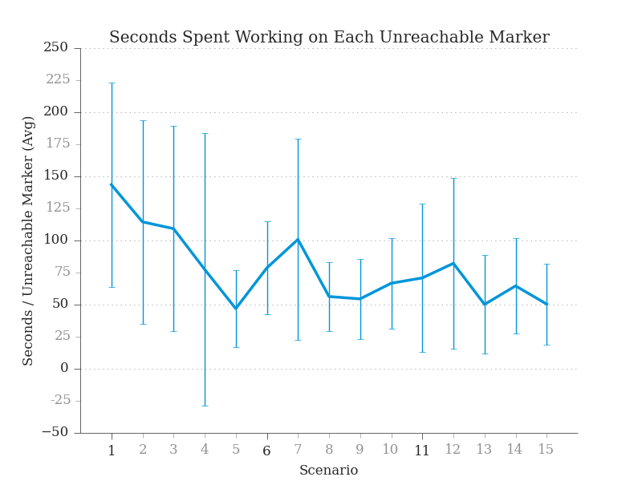

# beautyplot

A single function call to make `matplotlib.pyplot` plots look better. Because neither prettyplotlib nor matplotlibrc worked for me.

<table>
	<tr>
		<td></td>
		<td></td>
	</tr>
</table>

## Setup
Add `beautyplot.py` to your `PYTHONPATH` so that Python can find it. I've provided a script that does this called `setup.sh`. You can run it (on Unix-like systems) by typing the following in a terminal:

```bash
source setup.sh
```

To use it regularly, I recommend you add what's in `setup.sh` it to your `.bashrc` or the like.

## Usage
```python
import matplotlib.pyplot as plt
from beautyplot import beautify

# Crunch numbers
# ...

# Build your plot
plt.figure()
plt.title('Plot title')
plt.errorbar(xs,
	ys,
	yerr=stds,
	#aditional formatting goes here
	)
#...

# Here's the function call
beautify()

# Then take a look
plt.show()
```

## Features
### General
- set all things that were black (axis lines, labels, title, major tick labels, major ticks marks) to be off-black (a dark grey)

### Axes
- remove the top and right axis lines ('spines')
- make remaining axis lines thinner
- make dotted grid for major y lines

### Ticks
- turn off only right and top ticks
- set tick direction to be out (pointing out of graph)
- set all minor ticks labels and marks to be a lighter grey
- make major and minor ticks longer
- make tick numbers farther away (padded) to accomodate longer ticks

### Fonts
- set all fonts to be serif (like Times New Roman)

## Support
I'm making this utility "as I go" to support graphs that I need to plot. Here are the ones I've tested so far:

- `errorbar`

## Things you need to do on your own
A lot of things that you need to do to make your graph look good---or that you need to do to make `beautyplot` work well---aren't generalizable enough to put in `beautyplot`.

0. Make sure major and minor ticks are specified correctly. Check out:
   - [example](http://matplotlib.org/examples/pylab_examples/major_minor_demo1.html)
   - [api](http://matplotlib.org/api/ticker_api.html)

0. Set the plotting color. Use better colors than 'blue'. Check out:
   - [the scipy API for color maps](http://wiki.scipy.org/Cookbook/Matplotlib/Show_colormaps)
   - [the ColorBrewer color schemes](http://colorbrewer2.org/)

0. Set plotting style. Lines should be very differentiable, with lots of visual redundancy. This means the following should be different:
   - markers [e.g. circles, triangles, 'x's, ...]
   - color (see above)
   - and style [e.g. dashed, dotted, line, variations in-between]

0. Set error bar width and cap sizes. Error bars should be thinner than plotting lines. Check out:
   - [example](http://stackoverflow.com/questions/7601334/how-to-set-the-line-width-of-error-bar-caps-in-matplotlib)
 
## Acknowledgements
Thanks to Olga Botvinnik for her [blog post](http://blog.olgabotvinnik.com/post/58941062205/prettyplotlib-painlessly-create-beautiful-matplotlib) of the long (bad) way to do things in
matplotlib which, because I couldn't get her released code ([prettyplotlib](https://github.com/olgabot/prettyplotlib)) to work, is exactly what I'm doing.

There are several stackoverflow articles that made this possible, which I only thought of keeping track of quite late, but here are a few:

- [Customizing Just One Side of Tick Marks in Matplotlib Using Spines](http://stackoverflow.com/questions/9051494/customizing-just-one-side-of-tick-marks-in-matplotlib-using-spines)

- (use also [Axes::tick_params](http://matplotlib.org/api/axes_api.html#matplotlib.axes.Axes.tick_params))

- [Matplotlib Move x-axis Label Downwards but not x-axis Ticks](http://stackoverflow.com/questions/6406368/matplotlib-move-x-axis-label-downwards-but-not-x-axis-ticks) (though we want the 'wrong' answer, posed in the question, to move the tick numbers)
